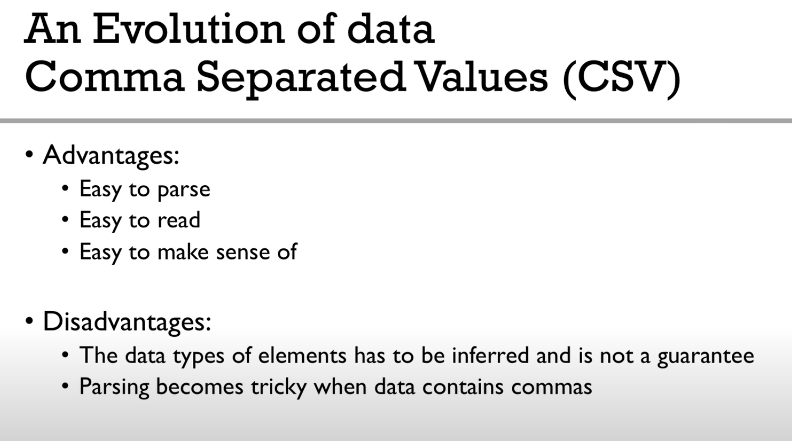
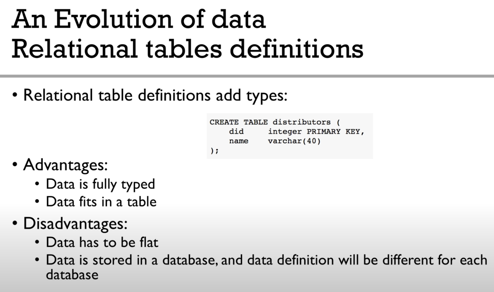
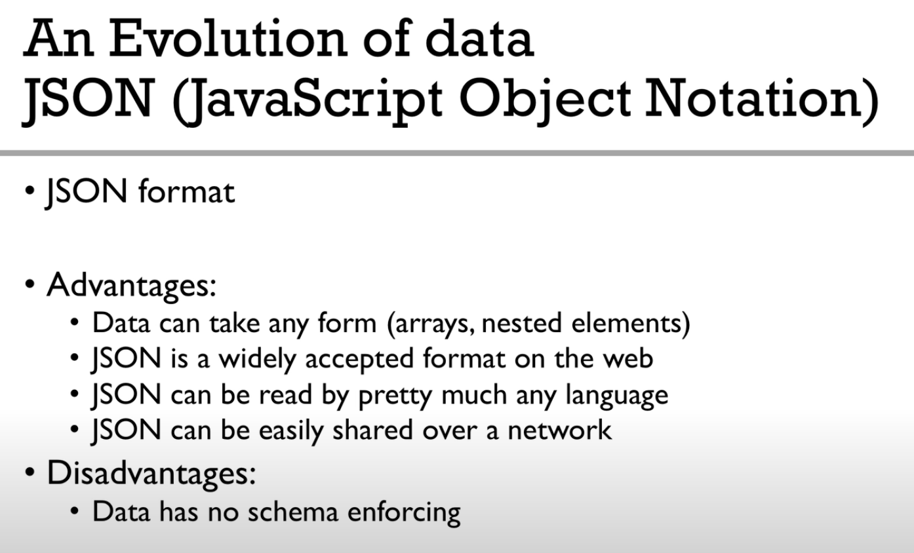

<h2> Evolution of Data Formats </h2>

* <h3> CSV </h3>
  
    

* <h3> RDBMS </h3>
  
    

* <h3> JSON </h3>
  
   

<h4> Links </h4>

* [Big Data File Formats](https://www.upsolver.com/blog/the-file-format-fundamentals-of-big-data)

