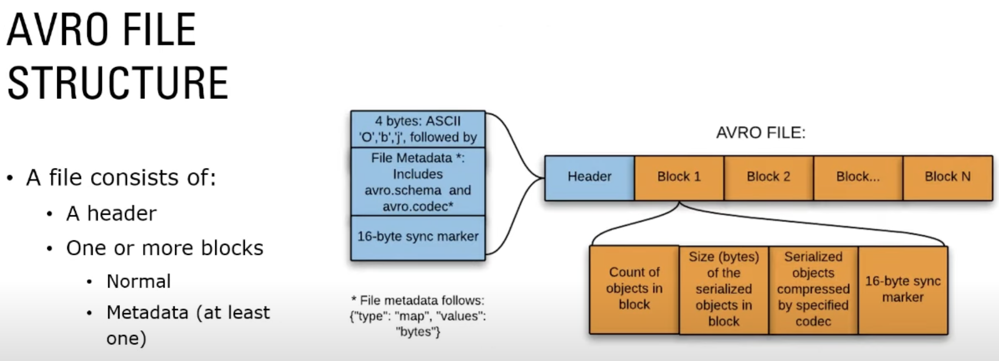

<h2> AVRO </h2>

<h3> Introduction </h3>

* Avro is a row-based storage format for Hadoop which is widely used as a serialization platform. 
* Avro stores the data definition (schema) in JSON format making it easy to read and interpret by any program. The data itself is stored in binary format making it compact and efficient. 
  * AVRO = Schema(json) + Data(Binary/(JSON -only in case of web based applications))
* A key feature of Avro is robust support for data schemas that change over time - schema evolution. Avro handles schema changes like missing fields, added fields and changed fields; as a result, old programs can read new data and new programs can read old data.
* Can be compressed because of serialization but is not as good as columnar formats like parquet.

<h3> AVRO File Format </h3>

* Avro includes a simple object container file format. A file has a schema, and all objects stored in the file must be written according to that schema, using binary encoding. Objects are stored in blocks that may be compressed. 
* Syncronization markers are used between blocks to permit efficient splitting of files for MapReduce processing.
* [AVRO File Format Documentation](https://avro.apache.org/docs/1.11.1/specification/#object-container-files)

* A file header consists of:

  * Four bytes, ASCII ‘O’, ‘b’, ‘j’, followed by 1.
  * file metadata, including the schema.
  * The 16-byte, randomly-generated sync marker for this file.
  * File metadata is written as if defined by the following map schema:
    * {"type": "map", "values": "bytes"}


* All metadata properties that start with “avro.” are reserved. The following file metadata properties are currently used:
  * avro.schema contains the schema of objects stored in the file, as JSON data (required).
  * avro.codec the name of the compression codec used to compress blocks, as a string. Implementations are required to support the following codecs: “null” and “deflate”. If codec is absent, it is assumed to be “null”. The codecs are described with more detail below.

* A file header is thus described by the following schema:

  ```
  {"type": "record", "name": "org.apache.avro.file.Header",
   "fields" : [
     {"name": "magic", "type": {"type": "fixed", "name": "Magic", "size": 4}},
     {"name": "meta", "type": {"type": "map", "values": "bytes"}},
     {"name": "sync", "type": {"type": "fixed", "name": "Sync", "size": 16}},
    ]
  }
  ```
  
* A file data block consists of:

  * A long indicating the count of objects in this block.
  * A long indicating the size in bytes of the serialized objects in the current block, after any codec is applied
  * The serialized objects. If a codec is specified, this is compressed by that codec.
  * The file’s 16-byte sync marker.
  * Thus, each block’s binary data can be efficiently extracted or skipped without deserializing the contents. The combination of block size, object counts, and sync markers enable detection of corrupt blocks and help ensure data integrity.




<h3> Advantages of AVRO </h3>

* Can be shared by programs using different languages
* Self-describing; bundles serialized data with data’s schema
* Supports schema evolution and flexibility
* Splittable
* Great with Kafka
* Compression options including uncompressed, snappy, deflate, bzip2, and xz. 


<h3> When to use AVRO ? </h3>

* Write-heavy operations (such as ingestion into a data lake) due to serialized row-based storage. 
* When writing speed with schema evolution (adaptability to change in metadata) is critical.
* When complete files needs to be read for transformation in that case row based storage is better at use.


<h4> Links </h4>

* BEST - [AVRO Documentation](https://avro.apache.org/docs/1.11.1/specification/#data-serialization-and-deserialization)
* Youtube - [AVRO](https://www.youtube.com/watch?v=k_4GM5EDNI8)
* [Working with AVRO](https://dzone.com/articles/new-article)
* [Intro to AVRO Format](https://sqream.com/blog/a-detailed-introduction-to-the-avro-data-format/)

