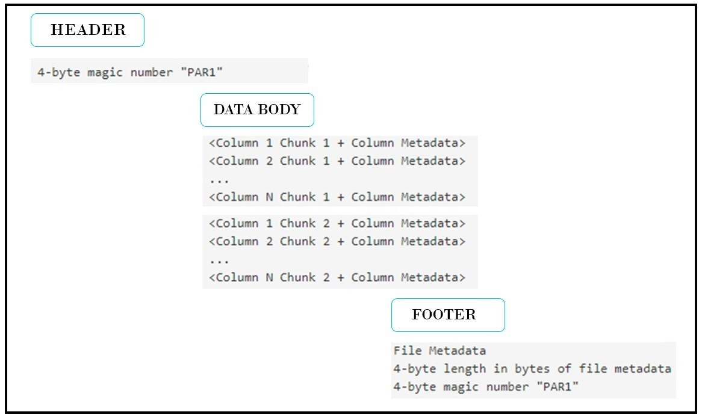
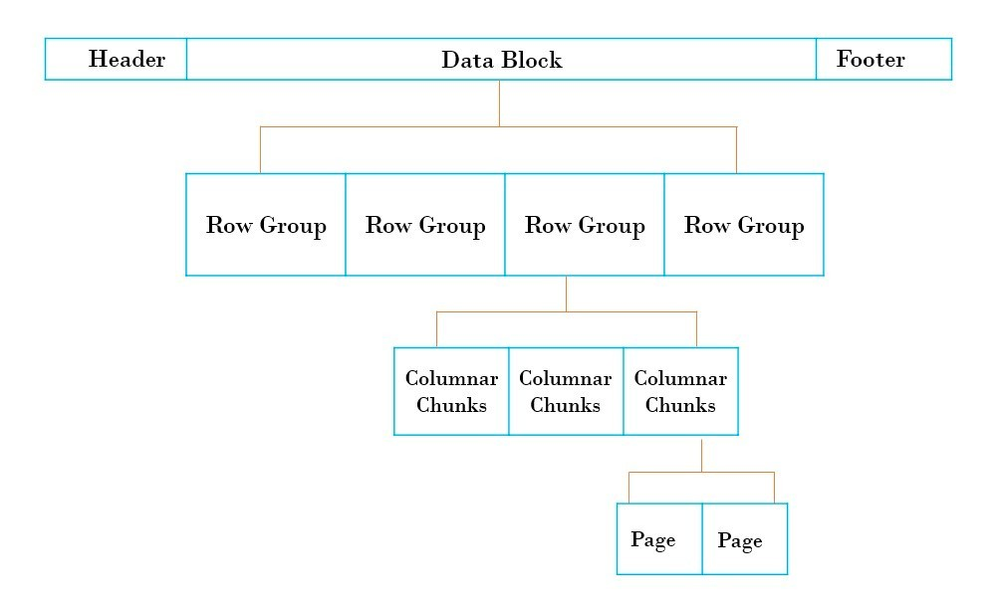
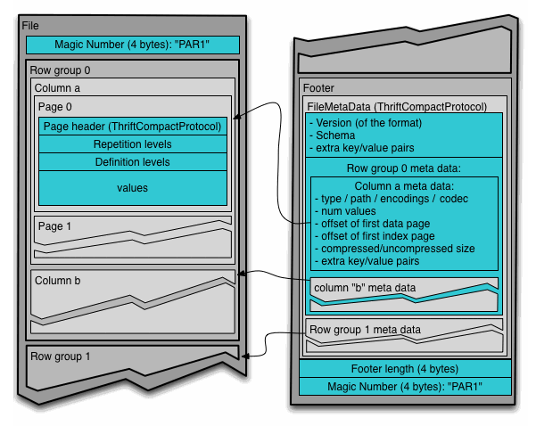

## Parquet

### Introduction
* Apache Parquet is an open source, column-oriented data file format designed for efficient data storage and retrieval.

### Parquet File Format 

=======================================================================================================
* At a high level, the parquet file consists of header, one or more blocks and footer.
* **HEADER** : The parquet file format contains a 4-byte magic number in the header (PAR1) and at the end of the footer. This is a magic number indicates that the file is in parquet format. 
* **METADATA** :
  * There are three types of metadata: file metadata, column (chunk) metadata and page header metadata.
  * **All the file metadata is stored in the footer section. Metadata is written after the data to allow for single pass writing.**
  * The file metadata contains the locations of all the column metadata start locations.
  * Readers are expected to first read the file metadata to find all the column chunks they are interested in. The columns chunks should then be read sequentially.
  * The format is explicitly designed to separate the metadata from the data. This allows splitting columns into multiple files, as well as having a single metadata file reference multiple parquet files.
  * In case of Parquet files, metadata is written after the data has been written, to allow for single pass writing.
  * Since the metadata is stored in the footer, while reading a parquet file, an initial seek will be performed to read the footer metadata length and then a backward seek will be performed to read the footer metadata.
=======================================================================================================

=======================================================================================================
* Each block in the parquet file is stored in the form of row groups. 
* So, data in a parquet file is partitioned into multiple row groups. 
* These row groups in turn consists of one or more column chunks which corresponds to a column in the dataset. 
* The data for each column chunk is then written in the form of pages. 
* Each page contains values for a particular column only, hence pages are very good candidates for compression as they contain similar values.
=======================================================================================================

* Parquet File format [link](https://parquet.apache.org/docs/file-format/)
* Metadata [link](https://parquet.apache.org/docs/file-format/metadata/)

### Advantages of Parquet
* Hybrid layouts are really effective for OLAP workflows because they support both projection and predicates.
    * Projection is the process of selecting columns - Projection pruning only reading columns which are required , done with the help of columns chuck in parquet.
    * Predicates is the criteria used to select rows - Predicate pushdown, Pushing down the filters first on parquest, appling it and then scanning only the required data. This is achieved using row group.
* Run Length Encoding  &  Dictionary Encoding with Bit-Packing {Great for compression}
* Storing big data of any kind (structured data tables, images, videos, documents).
* Ideal for services such as AWS Athena and Amazon Redshift Spectrum, which are serverless, interactive technologies.
* A good fit for Snowflake as it supports extremely efficient compression and encoding schemes. 
* When your full dataset has many columns, but you only need to access a subset.
* When you want multiple services to consume the same data from object storage.
* When you’re largely or wholly dependent on Spark. Great with spark

### Column Chunk and Page Indexing & Skipping
* Column Chuck metadata has page index used for skipping pages. With the introduction of this index, now the page header metadata(present in each page) does not have to be read to skip pages, leading to reducing i/o operations.
* [Column Chunk](https://parquet.apache.org/docs/file-format/data-pages/columnchunks/)
* [Page Skipping Using Page Index](https://github.com/apache/parquet-format/blob/master/PageIndex.md)

### Links
* BEST - [Parquet Documentation](https://parquet.apache.org/docs/overview/)
* Youtube [Parquet](https://www.youtube.com/watch?v=r2MWkYVomh4)
* Youtube [Parquet](https://www.youtube.com/watch?v=HyfGEbaZaX0)
* Youtube [Parquet Metadata Explore](https://www.youtube.com/watch?v=BjssGRlSnfA)
* BEST Parquet Article [link](https://www.linkedin.com/pulse/all-you-need-know-parquet-file-structure-depth-rohan-karanjawala#:~:text=Each%20block%20in%20the%20parquet,in%20the%20form%20of%20pages.)
* Parquet Article [link](https://towardsdatascience.com/demystifying-the-parquet-file-format-13adb0206705)
* Parquet Twitter Blog [link](https://blog.twitter.com/engineering/en_us/a/2013/dremel-made-simple-with-parquet)
* Youtube - Parquet Page & Column Index [link](https://www.youtube.com/watch?v=fr_HdhMEa3s)