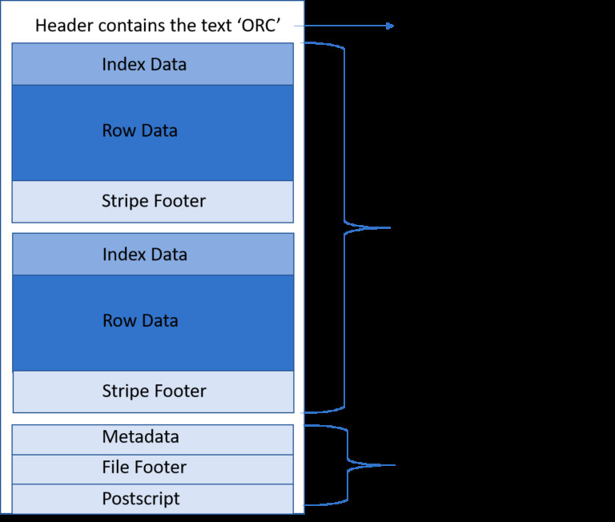
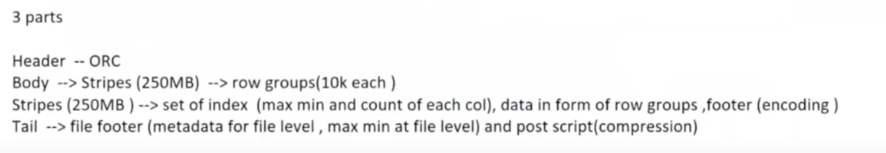
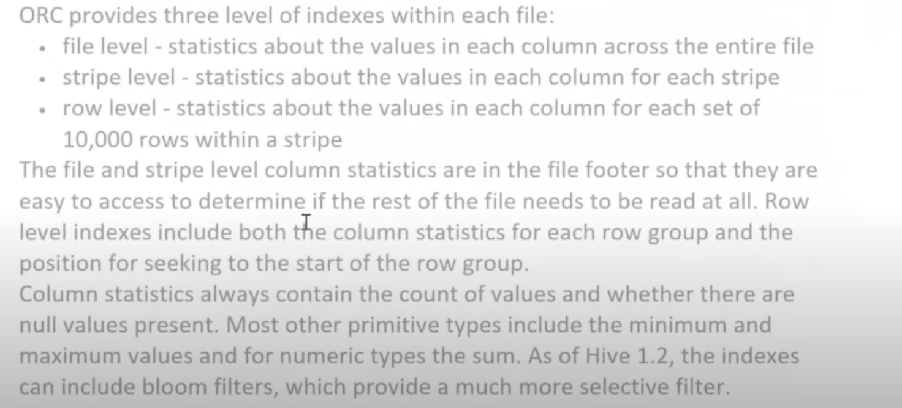
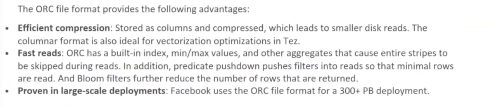

## ORC

### Introduction 
* It is a columnar based file system developed by facebook. It allows data skipping while reading without the need of large and complex indexes.
*  ORC was designed and optimized specifically with Hive data in mind, improving the overall performance when Hive reads, writes, and processes data.  As a result, ORC supports ACID transactions when working with Hive.

### ORC File Format

### ORC Indexes

###  Advantages of ORC
* ORC is often chosen over Parquet when compression is the sole criterion
* When reads constitute a significantly higher volume than writes.
* When you rely on Hive.

### Links
* Youtube [link](https://www.youtube.com/watch?v=IX5ElplseUY)
* Article [link](https://www.linkedin.com/pulse/all-you-need-know-orc-file-structure-depth-rohan-karanjawala)
