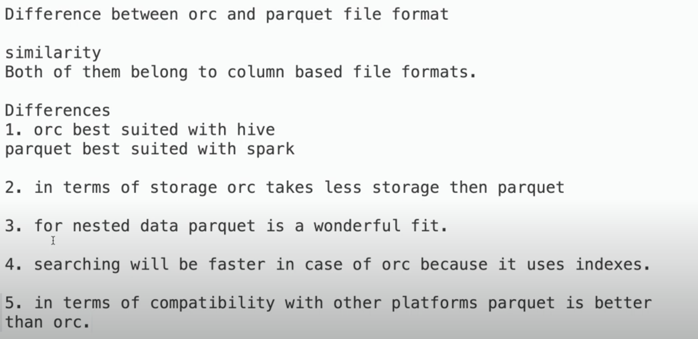
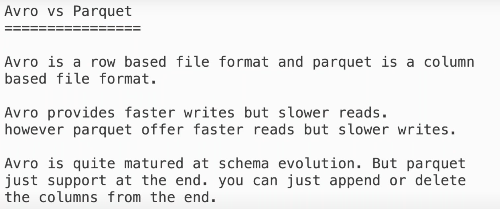
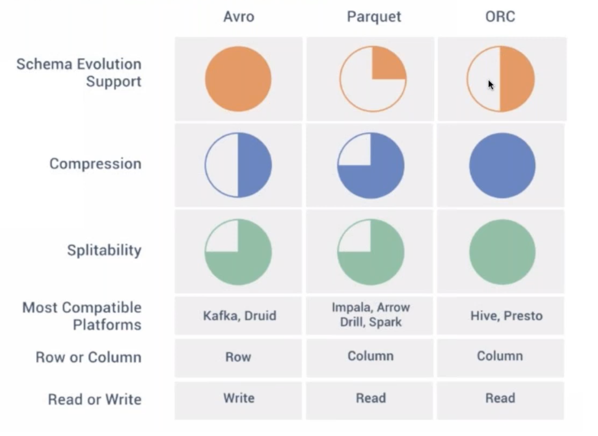

## AVRO VS ORC VS PARQUET

* File comparison focuses on 4 major pillars : 
  * Write Speed
  * Read Speed
  * Compression
  * Schema Evolution

  
### ORC vs Parquet

* [ORC vs Parquet](https://www.youtube.com/watch?v=Q9Nz7CgRQKU)

### AVRO vs Parquet

* [ORC vs Parquet](https://www.youtube.com/watch?v=yvej5JQagF8&list=PLtgiThe4j67q7ytpGuGnMMlFFMpv8dmka&index=3)

### AVRO vs Parquet vs ORC

* [ORC vs Parquet](https://www.youtube.com/watch?v=VQnlzBw9Pm0&list=PLtgiThe4j67q7ytpGuGnMMlFFMpv8dmka&index=4)

### Links
* [How-to-choose-between-parquet-orc-and-avro](https://bryteflow.com/how-to-choose-between-parquet-orc-and-avro/)
* [Big Data File Formats](https://www.upsolver.com/blog/the-file-format-fundamentals-of-big-data)
* Towards Data Science Article - [Big Data File Formats](https://towardsdatascience.com/big-data-file-formats-explained-275876dc1fc9)
