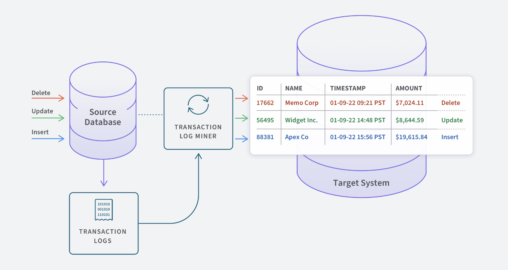

<h3> Change Data Capture </h3>

* It is a style of data movement. Usually good for capturing live changes to a database(real-time).

<h3> Types of CDC </h3>

* <h4> Query Based CDC </h4>

    * Here you query the data in the source to pick up changes . Usually need an update timestamp in data to pick up changes.

* <h4> Log Based CDC </h4>
    
    * When a new transaction comes into a database it gets logged into a log file with no impact on the source system.
      Which can then be picked up and moved from the log file.

* <h4> Trigger Based CDC </h4>

<h3> Links </h3>

* Article - [CDC](https://www.qlik.com/us/change-data-capture/cdc-change-data-capture#:~:text=Change%20data%20capture%20(CDC)%20refers,a%20downstream%20process%20or%20system.)
