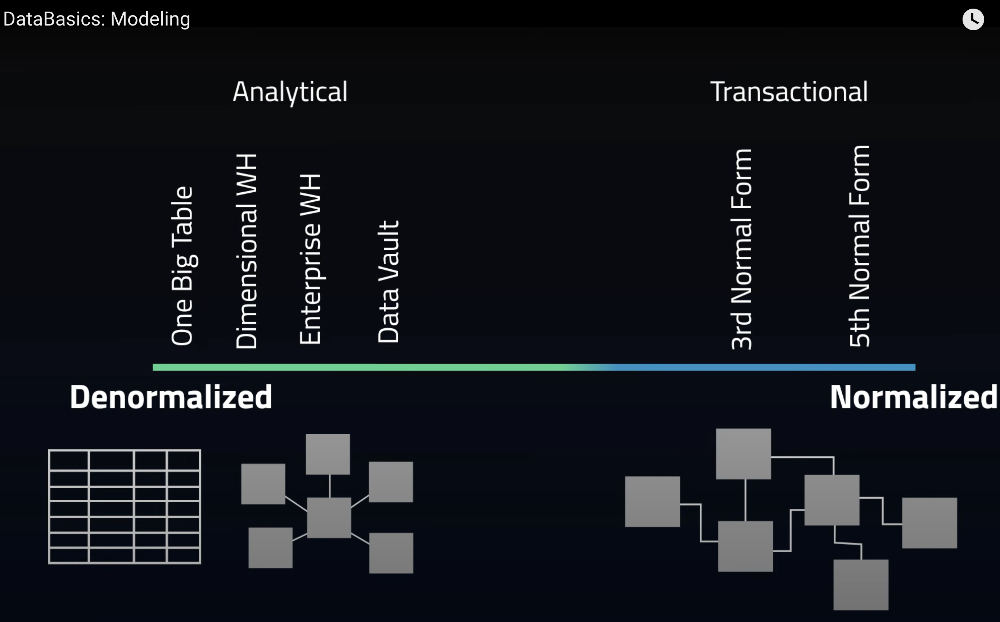

### Normalisation
- [1NF Form](https://www.geeksforgeeks.org/first-normal-form-1nf/)
- [2NF Form](https://www.geeksforgeeks.org/second-normal-form-2nf/?ref=lbp)
- [3NF Form](https://www.geeksforgeeks.org/third-normal-form-3nf/)
- [BCNF Form](https://www.geeksforgeeks.org/boyce-codd-normal-form-bcnf/?ref=lbp)
  - BCNF is a strict version of 3NF

- [Functional Dependencies](https://www.geeksforgeeks.org/types-of-functional-dependencies-in-dbms/)

### Data Modelling & Normalisation in different systems(OLAP vs OLTP)

### Resource 
- [Normalisation article](https://dataengineering.wiki/Concepts/Normalization)
- [De-Normalisation article](https://dataengineering.wiki/Concepts/Denormalization)
- [Normalisation Demo][https://www.youtube.com/watch?v=dsZy-2EJGec]