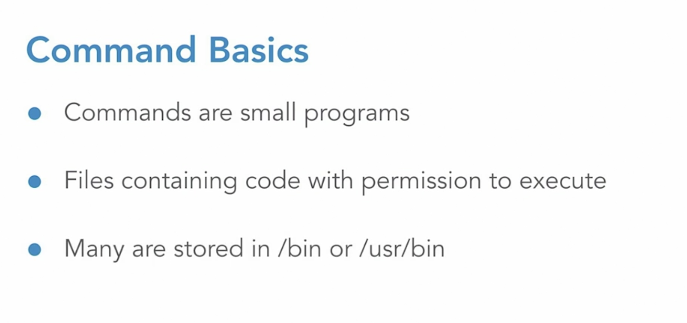

# Unix Commands

## Command Structure
* [command] + [options] + [arguments]

## Command
* A unix command is a small program
* `which command_name`  //Gives location of the command 
* `man command_name` // Tell how to use command
* PATH is where the shell looks for these commands file and runs those, that why we add these programs to PATH. 

## Options [optional]
* Can pe a single hyphen and then a single letter or Can be two hyphen and a word. // Eg : make -v  or make --version
* Different options can be combined or listed one at a time. Order of options doesnt matter. // Eg : ls -l -a -h  or ls -lah or ls -ahl

## Arguments [optional]
* An argument to go with the command