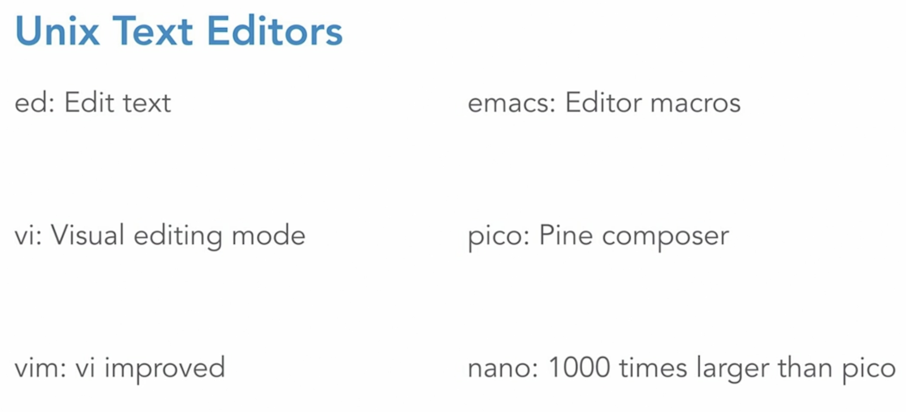

### Different Unix Text Editors

* NANO {upgrade of PICO} is the easiest to use. 
* VIM & EMACS are great functionaly but difficult to use.

### NANO COMMANDS

* nano //To start new file
* nano filename //To open existing file