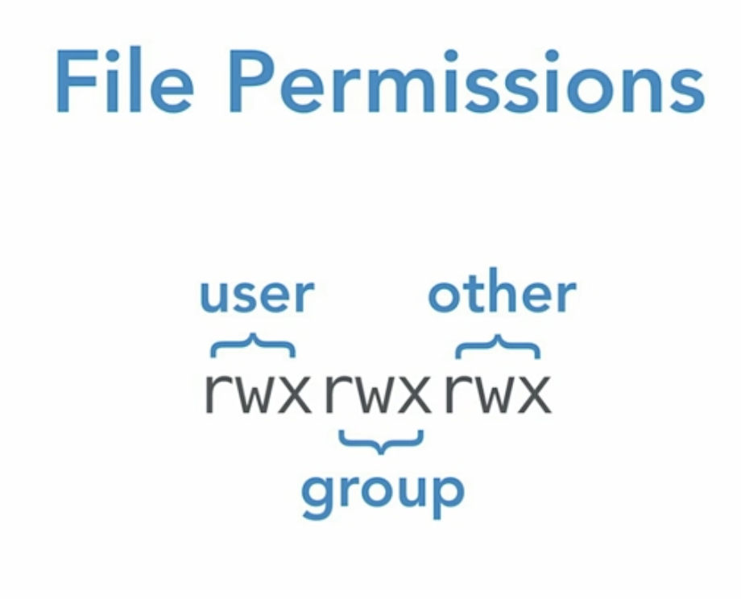
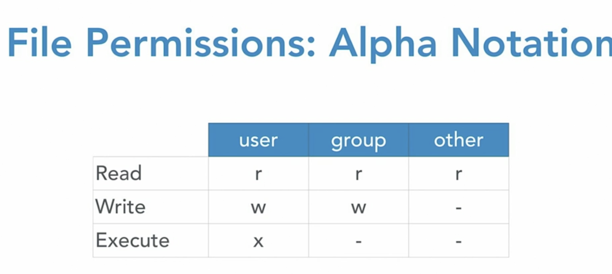
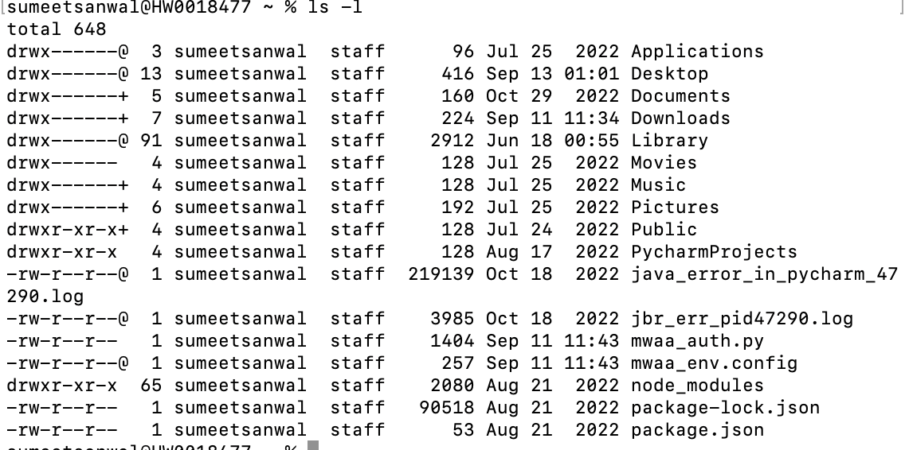
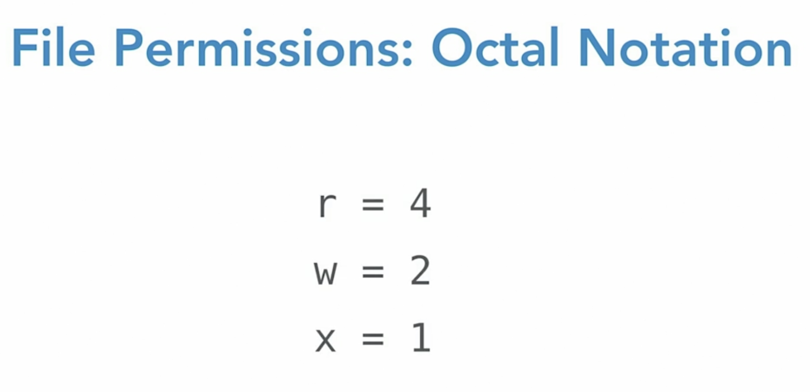

# File Ownership & Permissions

* `chwon user:group file1.txt` //chown - change owner&group of file1

 

* The first letter tell if it is file `l` or directory `d`.

* 4 - read
* 5 - read and execute
* 6 - read and write
* 7 - all
* 0 - none

## SUDO
* Substitute User and do
* `SUDO !!` // Run last command but usinf sudo 