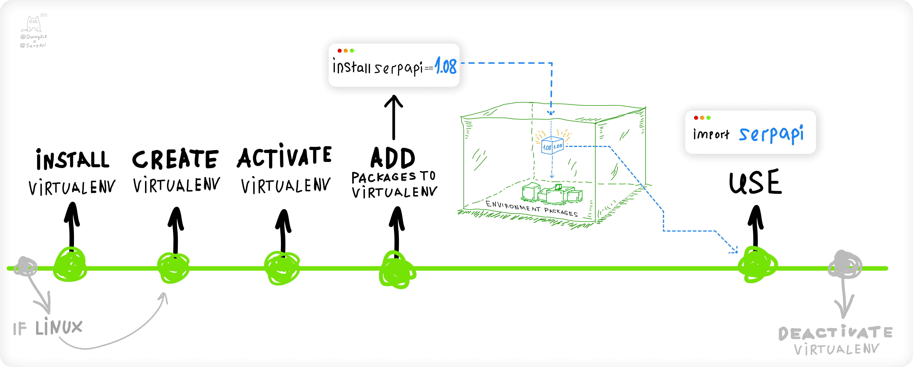

<h1>Virtual Environment :</h1> 

<h4> Articles :</h4>

* https://serpapi.com/blog/python-virtual-environments-using-virtualenv-and-poetry/
* https://realpython.com/python-virtual-environments-a-primer/
* https://www.the-analytics.club/virtualenv-alternative-for-python-dependency-management

 

<h4> What is a virtual environment ?</h4>
An isolated runtime environment that allows Python users and applications to install and upgrade Python distribution packages without interfering with the behavior of other Python applications running on the same system.

  
<h4>Why use a virtual environment? </h4>
Prevent packages or Python version conflicts when working with different projects that are running on the same system.

 

<h4> How to use a virtual environment? </h4>

 

<h4> Steps to run virtual environment </h4>

| Step                     | virtualenv | poetry            |
|--------------------------| ------------ |-------------------|
| Install                  | $ pip install virtualenv | $ pip install poetry |
|Create Virtual Env|$ python -m venv env|$ poetry init|
|Activate| $ source env/bin/activate| |
|Add Packages|(env) $ pip install pandas|$ poetry add pandas|
|Deactivate|(env) $ deactivate|$ deactivate|

 

<h4> Virtualenv vs Poetry </h4>

| virtualenv   | poetry|
|--------------|-------------------|
|Virtualenv is a tool for creating isolated Python environments. It allows you to install Python packages and their dependencies in a separate environment, without affecting the packages installed in the global Python environment.|It allows you to manage package dependencies, create and publish packages, and manage the structure of your project.|
|Virtual environments are tied to a specific path. If you move or rename the project folder, the original path doesn't change.|Unlike Virtualenv, Poetry can rename and relocate project.|
|Switching the python version in virtualenv is not possible.|Easily change python versions to test project compatibility with diff versions.|
|Virtualenv manages dependencies in an isolated environment. But they don't maintain a unique set of them for development only.|When adding a new package to the project, You can specify if it's only for development using the ‘-D’ flag.|
|Virtuanlenv doesnt allow publishing packages. |Poetry allows packaging and publishing python packages.|
|Consider virtualenv if you want a more lightweight tool for creating isolated Python environments, or if you prefer to manually manage dependencies using pip.|Consider Poetry if you want a tool that focuses on packaging and dependency management, and want to use a different file format for storing dependencies (pyproject.toml).|

