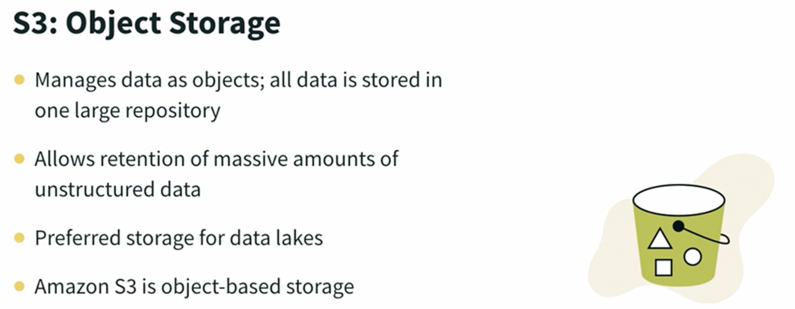

## Infra as a Service {Iaas} 

* Rent virtual infrastructure from a cloud provider and pay for only what you use.

## Identity and Access Management 

* Policies for access of various components on AWS.
* This is used to specific access and permissions of user of the org.

## Cloud Watch Service 

* Used for monitoring other services, set alarms and notifications. 

## Elastic Compute Cloud {EC2} 

* Amazon Machine Instance {AMI} - It is a virtual machine running on any of the physical hardware.
* Auto scaling 

## Cloudfront 

* It's a CDN (content distribution network).
* Replicates your S3 bucket in different regions to serve at better speed for users across globe.

## STORAGE 

* #### Elastic Block Storage {EBS}
    * Two or more AMI can't use the same EBS, so can't be used by multiple AMIs.
    

* #### Elastic File Storage 
    * Not as fast as EBS
    * Allows to share drive across several AMIs.
    

* #### Simple Storage Service {S3}
    * It is a file sharing service which doesn't require an AMI/compute to which it has to be connected to for sharing.
    * Slower than EFS and EBS.
    

* #### S3 Glacier 
    * Cheaper storage class in S3
    * When you have older data, but you don't want to delete it, it can be moved to S3 glacier.
    * Data pull takes alot of time, so put data which is not frequently used only.

## Network 

* <h4> Virtual Private Cloud {VPC} </h4>

    * These are subnets created.
    * The private subnets allow databases to communicate to each other without having to connect to internet.
    * The public subnets allow internet connection.
    * VPC provides various use cases like static IP whitelisting,security, etc.

* <h4> Network Address Translation {NAT} </h4>

    * Allows all your WAN devices connected together to access internet via a single IP provided by ISP.
    * Each time the instance starts and stops the IP changes, to fix this issue elastic IPs coule be used which are linked to your account and not the EC2 instance.

* <h4> Elastic Load Balancer {ELB}</h4>
    
    * Application Load Balancer
    * Network Load Balancer

* <h4> Route 53 </h4>

    * DNS service of AWS
    * Convert domain names to IP address.

## AWS Glue 

  * Fully managed ETL Service.
  * Has spark ETL engine. 

  * <h4> DATA CATALOGUE </h4>
    
    * Database [Metadata Storage] : 
      * Tables : Holds Schema of tables.
      * Connection : Holds connection details.
      
    * Partition : Separate based on date, data-type, location, etc for faster search.
    * Crawlers : Automated crawlers to get schema of tables in data catalogue.
    * Jobs : Automated ETL tools to generate script/jobs that perform ETL.

## Links 

* LinkedIn Course - [AWS Basics](https://www.linkedin.com/learning/instructors/hiroko-nishimura?u=77964786)
* Youtube - [AWS Glue](https://www.youtube.com/watch?v=dQnRP6X8QAU&t=1080s)
