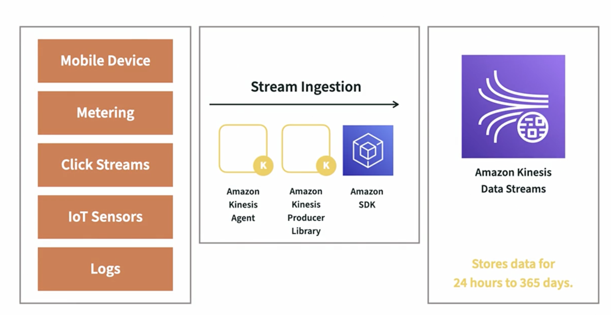

## Data Lake Architecture

## Data Pipeline Components

[//]: # (========================================NEXT MODULE==================================)

## 1. Data Sources
  

[//]: # (========================================NEXT MODULE==================================)

## 2. Data Ingestion

  * ### Data Ingestion Considerations
    * Type of Data - Mysql, DDB, ES, etc
    * Data format - structured, un-structured, semi-structured
    * Data Frequency :
      * 1-5 min - Real Time 
      * Less than 1hr - Near Real Time
      * More than 1 hr - Batch
    * Optimal size : 16 - 256mb files to reduce number of I/O operations overhead.
    * Compaction - Clubbing smaller file to make a larger not fragmented file to reduce I/O operations and improve performance.
    * File Format - Parquet, HUDI, ORC, Delta, etc
    * Partitions - Folder structure needed like based on date, cluster, etc partitioning
    * Ingestion Patterns - 
      * Batch Processing - Glue, Spark, AWS sync, COPY to Snowflake, etc
      * Real Time - Kinesis Firehouse, Kinesis Streams, Managed kafka, etc
      * One time on-premise to cloud migration - Data Migration Service(DMS), Snowmobile(hardware device), 
      * Cloud & On-premise Hybrid : Data Connect, Storage Gateway, etc
      
    

  
  * ### Amazon Kinesis 
    
    * ### Type of Kinesis Services?
        

        
     
     

  * ### Amazon Kinesis Data Stream

    * ### What is Amazon Kinesis Data Streams?
        
     
    
    * ### Kinesis Data Stream Ingestion Architecture
        
        
     
    
    * ### Kinesis Produces
       
     
    
    * ### Kinesis Consumers
       
     
     

  * ### Amazon Kinesis Firehose

    * ### What is Amazon Kinesis Firehose?
       
     
       
     
       
     
     
    
    * ### Amazon Kinesis Firehose Architecture
       

    
    

[//]: # (========================================NEXT MODULE==================================)

## 3. Data Storage

  * ### Data Storage Considerations
    
   
   

  * ### Type of Storage Options in AWS

    * #### Elastic Block Storage {EBS}
      * Two or more AMI can't use the same EBS, so can't be used by multiple AMIs.
      

    * #### Elastic File Storage
      * Not as fast as EBS
      * Allows to share drive across several AMIs.
      
  
    * #### Simple Storage Service {S3}
        * It is a file sharing service which doesn't require an AMI/compute to which it has to be connected to for sharing.
        * Slower than EFS and EBS.
        

[//]: # (========================================NEXT MODULE==================================)

## 4. Data Catalogue
